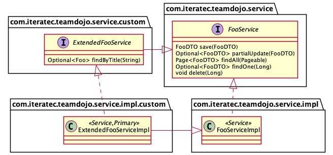
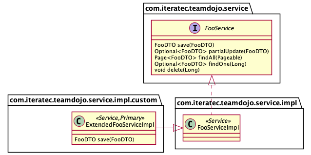

# ADR-0002: Extending Generated Code from JHipster with Custom Code

| <!-- -->       | <!-- -->                                           |
|----------------|----------------------------------------------------|
| **Status**:    | ACCEPTED                                           |
| **Date**:      | 2021-05-11                                         |
| **Author(s)**: | Sven Strittmatter <sven.strittmatter@iteratec.com> |

## Context

JHipster generates the full stack of an application based on
some [model definition (JDL)](https://www.jhipster.tech/jdl/intro). This includes the entities, repositories services
controllers etc. So you get all basic CRUD operations for free. But at some point we need to add own business logic.
Usually we try to add it into own services/controllers, but for some cases we need to extend or change the behaviour of
generated code. In the v1 the developers just changed the generated code. This is one of the biggest mistakes you can do
with generated code because this makes it nearly impossible to upgrade to newer versions of the generator because you
have lots of conflicts to merge.

First and only rule for dealing with generated code is: **You never ever change generated code!** The patterns how to _
modify_ the behaviour of generated code are either _subclassing_ or _dependency injection_

David Steinman describes in his Talk [JHipster side-by-side in practice](https://youtu.be/Gg5CYoBdpVo) how to achieve
such a side-by-side implementation.

## Decision

Some basic rules:

1. All custom code **must** be placed in a separate subpackage named "custom". E.g. custom services will be located in
   the package `com.iteratec.teamdojo.service.custom`, custom DTOs in `com.iteratec.teamdojo.service.dto.custom` and so
   on.
2. All custom types extending a generated one **must** be prefixed with `Extended`. E.g. `ExtendedFooService` for a type
   extending `FooService` or `ExtendedFooDTO` for a type extending `FooDTO` and so on.
3. All custom types not extending generated code, but swapping out an existing generated type or add a completely new
   one **must** be prefixed with `Custom`. E.g. `CustomFooReporisotry`.

### Controllers

TODO

### Services

There are two use cases to modify behaviour of generated services:

1. Add custom service API and
2. modify existing service API.

#### Add custom service API

Imagine a service interface `FooService` with its implementation `FooServiceImpl` and you want to add a new
method `Optional<Foo> findByTitle(String name)` to its API. You can not simply add it to the interface `FooService`
because this breaks the rule of modifying generated code from above. The solution is to extend the interface and
implementation as shown in the following class diagram:



The basic idea is to extend the existing interface of the service (its API) and add the additional API to this extending
interface:

```java
package com.iteratec.teamdojo.service.custom;

public interface ExtendedFooService extends FooService {
    Optional<Foo> findByTitle(String name);
}
```

Then create a new implementation of the extending interface and also extend the generated service:

```java
package com.iteratec.teamdojo.service.impl.custom;

@Primary // THIS IS MANDATORY to enforce DI to use this implementation!
@Service
public class ExtendedFooServiceImpl extends FooServiceImpl implements ExtendedFooService {
    @Override
    public Optional<Foo> findByTitle(String name) {
        // Your custom business logic goes here.
    }
}  
```

The trick is done by the [dependency injection (DI)](https://en.wikipedia.org/wiki/Dependency_injection) of Spring Boot.
DI works the way that you only specify the interface of a service (or any other type) you want to use. In this example
`private FooService myServcie`. At runtime DI looks for any implementation of the interface, creates an instance of such
an implementation and injects it to the field. Usually there is only one such implementation in typical Spring Boot
applications, but with the pattern described above we have two implementations of `FooService`,
particularly `FooServiceImpl` and `ExtendedFooServiceImpl`. But we want to enforce the DI always to use
our `ExtendedFooServiceImpl`. This is achieved by annotating the extended service with `@Primary`.

#### Modify Existing Service API

Sometimes it is not sufficient to simply add a new method to the service API. In some cases we need to change the
behaviour of an existing implementation. Imagine the `FooService` from above. But this time we want to execute some
additional business logic in the existing `FooDTO save(FooDTO)` method. This works quite the same way as the example
above, but without the need to introduce a new service interface:



The only important detail in this approach is to properly override the method. You have to ask: Do I want to add logic
before the original implementation is called or afterwards or both (around) or do I want to implement the method
completely by my own. The code for additional behaviour before and after will look like:

```java
package com.iteratec.teamdojo.service.impl.custom;

@Primary // THIS IS MANDATORY to enforce DI to use this implementation!
@Service
public class ExtendedFooServiceImpl extends FooServiceImpl implements FooService {
    @Override
    public FooDTO save(FooDTO dto) {
        before(dto);
        final var result = super.save(dto);
        after(result);
        return result;
    }

    private void before(FooDTO dto) {
        // Here goes the behavior to add before the original implementation.
    }

    private void after(FooDTO dto) {
        // Here goes the behavior to add after the original implementation.
    }
}
```

This works exactly the same way as the previous example by adding `@Primary` to the implementation. The patternof this
code is sometimes called

### Repositories

TODO

### How to Change Generated Code Anyway

If we need to change generated code for good reasons then we encapsulate each modification in eye-catchers:

```java
class Foo {

    public Page<BadgeDTO> doSomeFoo() {
        log.debug("REST request to get Badges by criteria: {}", criteria);

        // ### MODIFICATION-START ###
        if (extension.shouldFindBadgesBySkills(criteria)) {
            return extension.findBadgesBySkills(criteria, pageable);
        }
        // ### MODIFICATION-END ###

        Page<BadgeDTO> page = badgeQueryService.findByCriteria(criteria, pageable);
        // ...
        return page;
    }
}
```

This allows us to quickly identify custom modifications in the diff if we regenerate the code.

## Consequences

We have some overhead due to additional classes and interfaces, but it is worth the easier upgrade path for new JHipster
versions.
