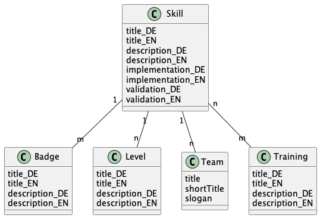
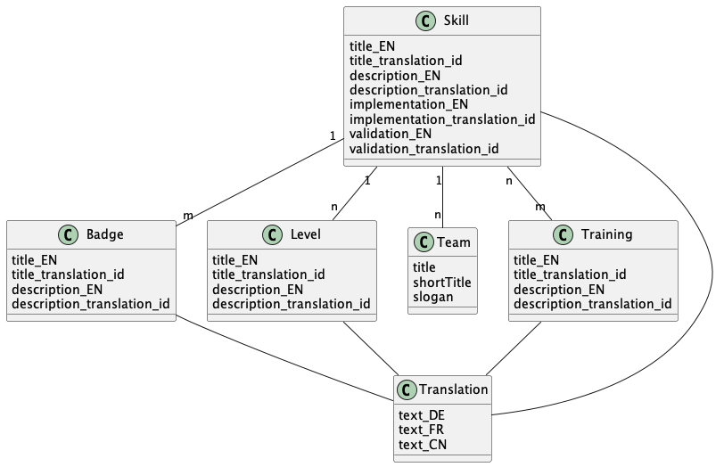
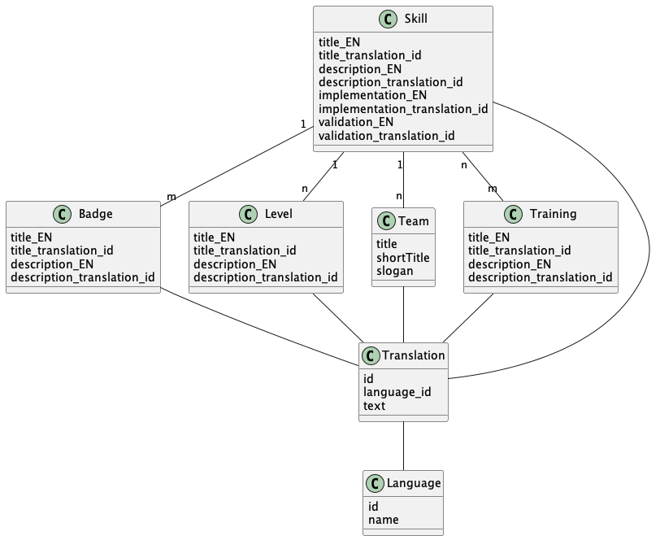
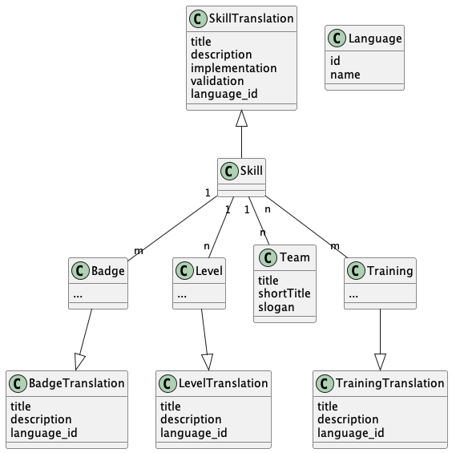

<!-- 
SPDX-FileCopyrightText: the TeamDojo authors

SPDX-License-Identifier: Apache-2.0
-->
# ADR-0003: I18n of Database Content

| <!-- -->       | <!-- -->                                                                                       |
|----------------|------------------------------------------------------------------------------------------------|
| **Status**:    | ACCEPTED                                                                                       |
| **Date**:      | 2022-05-04                                                                                     |
| **Author(s)**: | Sven Strittmatter <sven.strittmatter@iteratec.com>, Robert Felber <robert.felber@iteratec.com> |

## Context

At the moment we only support one language of user generated content (e.g. skills), but we need translated versions of such content. In consequence, we need to extend the database model in such a way we can store translated content.

As described by [Shantanu Kher][blog-localization-ready] and [Saikrishna Dronavalli][blog-l10n-design-patterns] there are mainly four patterns to solve this problem:

### Pattern 1: Separate Language Columns

Adding separate language columns for each translated field.

### Pattern 2: Separate Language Table Columns

Creating a separate table for translated text with column for each language.

> To get better performance when translated text is being retrieved, we can split the translation table into multiple tables. We can group the records based on domain, i.e. one table for customer, another for product, etc. --Shantanu Kher

### Pattern 3: Separate Language Table Rows

A Translation table with rows for each language.

### Pattern 4: Separate Language Layer

Creating entity layers for translated fields and non-translated fields.

### Considerations

From architectural perspective pattern three or four ios the best choice because it allows adding new languages without changing code or data model. But it would be mandatory to improve the admin UI for editing the content because it would be cumbersome and error-prone to set the foreign keys from domain object tables to language and content tables. Change the admin UI would imply modifying the admin UI generated by JHipster. One reason to use JHipster was that we do not want to spend a lot of time adding CRUD functionality for editing the content. The generated admin UI should be sufficient because content is edited not that often.

Performance aspects were not considered because we do not expect heavy load for a TeamDojo instance like for a webshop or such.

## Decision

We decided to use pattern one because customers only need two languages (German and English). So, it is less effort to simply rename the existing columns (`*_EN`) and add new columns (`*_DE`).

If more languages are necessary in the future we can evolve to pattern three or four.

## Consequences

1. If we need more languages we must add new columns to each translated table.
2. We must change the frontend to select the right property to display.
3. If we want to evolve to pattern two, three or four we need a migration script for existing data.

[blog-localization-ready]: https://www.vertabelo.com/blog/data-modeling-for-multiple-languages-how-to-design-a-localization-ready-system/
[blog-l10n-design-patterns]: https://medium.com/walkin/database-internationalization-i18n-localization-l10n-design-patterns-94ff372375c6
